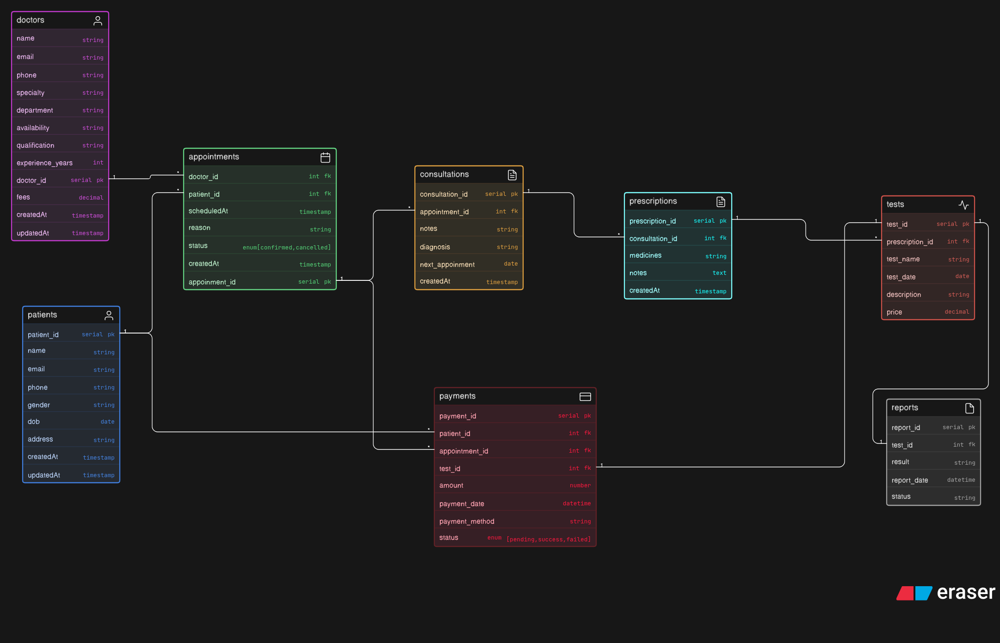

# 🏥 Clinic Appointment & Diagnostics Platform

This project represents a relational database design for a clinic management system. It handles doctors, patients, appointments, consultations, prescriptions, diagnostic tests, reports, and payments.

---

## 📊 Overview

The system is designed to:

- Manage doctor and patient information  
- Schedule and track appointments  
- Record consultations and diagnoses  
- Handle prescriptions and medical tests  
- Store test reports  
- Track payments and billing  

---

## 🧩 Database Schema

### 1. Doctors
Stores doctor details.

- `doctor_id` (PK)
- `name`, `email`, `phone`
- `specialty`, `department`
- `availability`, `qualification`
- `experience_years`, `fees`
- `createdAt`, `updatedAt`

---

### 2. Patients
Stores patient information.

- `patient_id` (PK)
- `name`, `email`, `phone`
- `gender`, `dob`, `address`
- `createdAt`, `updatedAt`

---

### 3. Appointments
Links doctors and patients.

- `appointment_id` (PK)
- `doctor_id` (FK → Doctors)
- `patient_id` (FK → Patients)
- `scheduledAt`, `reason`
- `status` (confirmed, cancelled)
- `createdAt`

---

### 4. Consultations
Details of a patient visit.

- `consultation_id` (PK)
- `appointment_id` (FK → Appointments)
- `notes`, `diagnosis`
- `next_appointment`
- `createdAt`

---

### 5. Prescriptions
Prescribed medications after consultation.

- `prescription_id` (PK)
- `consultation_id` (FK → Consultations)
- `medicines`, `notes`
- `createdAt`

---

### 6. Tests
Diagnostic tests linked to prescriptions.

- `test_id` (PK)
- `prescription_id` (FK → Prescriptions)
- `test_name`, `test_date`
- `description`, `price`

---

### 7. Reports
Results of tests.

- `report_id` (PK)
- `test_id` (FK → Tests)
- `result`, `report_date`
- `status`

---

### 8. Payments
Tracks financial transactions.

- `payment_id` (PK)
- `patient_id` (FK → Patients)
- `appointment_id` (FK → Appointments)
- `test_id` (FK → Tests)
- `amount`, `payment_date`
- `payment_method`
- `status` (pending, success, failed)

---

## 🔗 Relationships

- A doctor can have many appointments  
- A patient can have many appointments  
- Each appointment can lead to one consultation  
- A consultation can have one prescription  
- A prescription can include multiple tests  
- Each test generates a report  
- Payments can be linked to appointments and/or tests  

