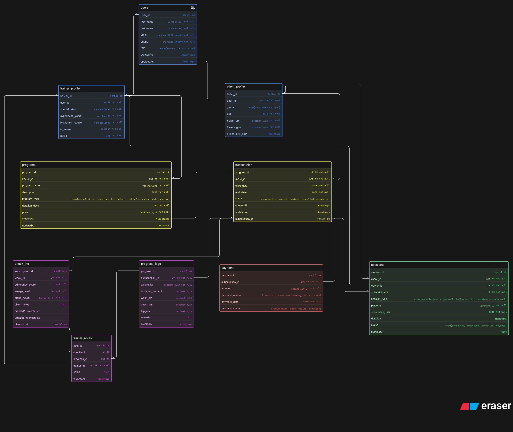

# Fitness Influencer Coaching Platform — ER Diagram

## Overview
This project contains the ER design for a **Fitness Influencer Coaching Platform**.  
The platform is made for trainers/influencers who provide online fitness services such as:

- one-to-one consultation
- long-term coaching
- live sessions
- diet-only plans
- workout-only plans
- client progress tracking
- regular check-ins

The database is designed to manage trainers, clients, programs, subscriptions, payments, sessions, progress logs, check-ins, and trainer notes.

---

## Main Entities

### 1. Users
Stores the basic information of every user in the system.

Examples:
- trainer
- client

**Important fields:**
- `user_id`
- `first_name`
- `last_name`
- `email`
- `phone`
- `role`

---

### 2. Trainer Profile
Stores trainer-specific details linked to a user.

**Important fields:**
- `trainer_id`
- `user_id` (FK)
- `specialization`
- `experience_years`
- `instagram_handle`
- `is_active`
- `rating`

---

### 3. Client Profile
Stores client-specific details linked to a user.

**Important fields:**
- `client_id`
- `user_id` (FK)
- `gender`
- `dob`
- `height_cm`
- `fitness_goal`
- `onboarding_date`

---

### 4. Programs
Represents the fitness services or plans created by trainers.

Examples:
- consultation
- coaching
- live batch
- diet only
- workout only
- custom

**Important fields:**
- `program_id`
- `trainer_id` (FK)
- `program_name`
- `description`
- `program_type`
- `duration_days`
- `price`

---

### 5. Subscription
Connects a client to a program.

This table helps track:
- when a client started a program
- when it ends
- whether it is active, paused, expired, cancelled, or completed

**Important fields:**
- `subscription_id`
- `program_id` (FK)
- `client_id` (FK)
- `start_date`
- `end_date`
- `status`

---

### 6. Payment
Stores payment details for subscriptions.

**Important fields:**
- `payment_id`
- `subscription_id` (FK)
- `amount`
- `payment_method`
- `payment_date`
- `payment_status`

---

### 7. Sessions
Stores scheduled interactions between trainer and client.

Examples:
- consultation
- video call
- follow-up
- live session
- check-in call

**Important fields:**
- `session_id`
- `client_id` (FK)
- `trainer_id` (FK)
- `subscription_id` (FK)
- `session_type`
- `platform`
- `scheduled_date`
- `status`
- `summary`

---

### 8. Check-ins
Used for weekly or regular client follow-up.

This table can store:
- week number
- adherence score
- energy level
- sleep hours
- client notes

**Important fields:**
- `checkin_id`
- `subscription_id` (FK)
- `week_no`
- `adherence_score`
- `energy_level`
- `sleep_hours`
- `client_notes`

---

### 9. Progress Logs
Stores physical progress of the client during a subscription.

Examples:
- weight
- body fat %
- waist
- chest
- hip
- remarks

**Important fields:**
- `progress_id`
- `subscription_id` (FK)
- `weight_kg`
- `body_fat_percent`
- `waist_cm`
- `chest_cm`
- `hip_cm`
- `remarks`

---

### 10. Trainer Notes
Stores notes written by trainers for either:
- a check-in
- a progress log

**Important fields:**
- `note_id`
- `checkin_id` (FK)
- `progress_id` (FK)
- `trainer_id` (FK)
- `notes`

---

## Relationships Summary

- One **user** can become one **trainer profile** or one **client profile**
- One **trainer** can create many **programs**
- One **client** can have many **subscriptions**
- One **program** can have many **subscriptions**
- One **subscription** can have many:
  - payments
  - check-ins
  - progress logs
  - sessions
- One **trainer** can conduct many **sessions**
- One **client** can attend many **sessions**
- One **trainer** can write many **trainer notes**

---

## Purpose of the Design
This ER design helps the platform manage the full online coaching workflow:

- onboarding users
- separating trainer and client details
- creating coaching programs
- assigning clients to programs
- handling subscription lifecycle
- tracking payments
- scheduling calls/sessions
- monitoring client progress
- storing trainer feedback and notes

---

## Conclusion
This database design is suitable for an **online fitness coaching ecosystem** where trainers manage multiple clients through subscriptions, sessions, progress tracking, and personalized guidance.

It is not a gym management system.  
It focuses more on **digital coaching, consultations, progress tracking, and subscription-based services**.

