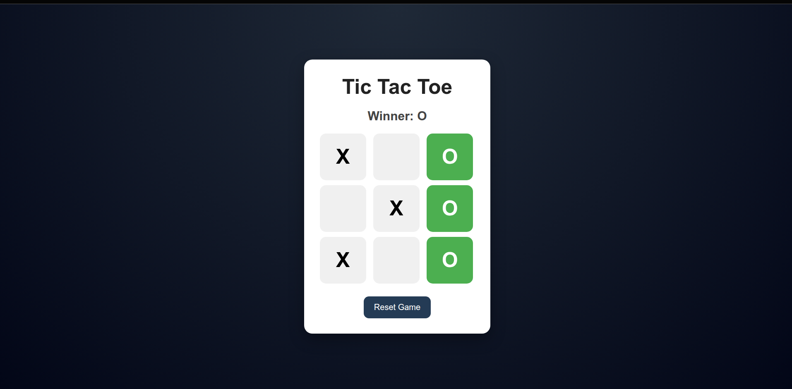

# Tic Tac Toe Game 🎮

A clean and interactive Tic Tac Toe game built using React.  
This project focuses on component structure, state management, game logic, and user interaction with a modern UI.

---

## 🚀 Features

- 3x3 interactive game board
- Two-player turn system
- Winner detection
- Draw detection
- Reset game functionality
- Current turn indicator
- Winning row highlight
- Responsive and modern UI
- Built with React Hooks (`useState`)

---

## 🛠️ Tech Stack

- React
- JavaScript
- CSS

---

## 📂 Project Structure

```bash
src/
│── App.jsx
│── App.css
│── main.jsx
```

---

## ⚙️ Installation & Setup

Clone the repository:

```bash
git clone <your-repository-link>
```

Navigate to the project folder:

```bash
cd tic-tac-toe
```

Install dependencies:

```bash
npm install
```

Start the development server:

```bash
npm run dev
```

---

## 🎯 Game Rules

- The game is played between two players: **X** and **O**
- Players take turns clicking empty squares
- The first player to align 3 symbols horizontally, vertically, or diagonally wins
- If all squares are filled without a winner, the game ends in a draw

---

## 🧠 Concepts Used

- React Components
- Props
- State Management
- Conditional Rendering
- Array Mapping
- Event Handling
- Game Logic Implementation

---

## 📸 Screenshot




---

## 🔥 Future Improvements

- Add score tracking
- Add multiplayer online mode
- Add sound effects
- Add dark/light theme toggle
- Add AI opponent

---

## 👨‍💻 Author

Developed using React and CSS.