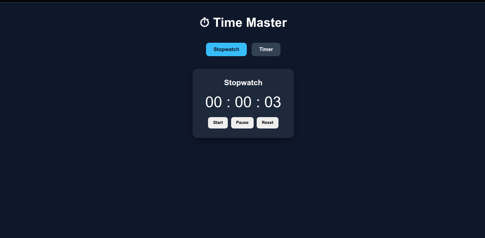
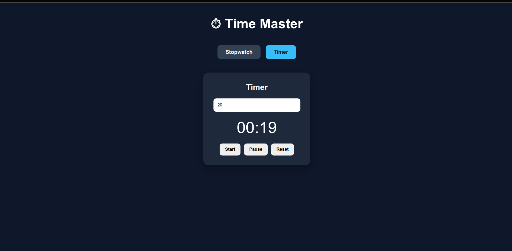

# Stopwatch & Timer App

A modern and responsive Stopwatch and Timer application built using React.  
This project demonstrates React Hooks, state management, time handling, conditional rendering, and responsive UI design.

---

# Features

## Stopwatch

- Start stopwatch
- Pause stopwatch
- Reset stopwatch
- Displays time in:
  - Hours
  - Minutes
  - Seconds

## Timer

- Custom time input
- Start timer
- Pause timer
- Reset timer
- Countdown functionality

## UI Features

- Responsive design
- Toggle navigation between Stopwatch and Timer
- Clean and modern interface
- Smooth user experience

---

# Tech Stack

- React
- Vite
- CSS

---

# Project Structure

```bash
src/
│
├── components/
│   ├── Stopwatch.jsx
│   └── Timer.jsx
│
├── App.jsx
├── main.jsx
└── index.css
```

---

# Installation & Setup

## Clone the repository

```bash
git clone YOUR_GITHUB_REPOSITORY_LINK
```

## Navigate to project folder

```bash
cd stopwatch-timer-app
```

## Install dependencies

```bash
npm install
```

## Run development server

```bash
npm run dev
```

---

# Build for Production

```bash
npm run build
```

---

# Concepts Used

- React Hooks
  - useState
  - useEffect

- State Management
- Conditional Rendering
- Event Handling
- setInterval
- Cleanup Functions
- Responsive Design

---

# Screenshots





live link- https://time-master-psi.vercel.app/
# Author

Joydeep Banerjee
